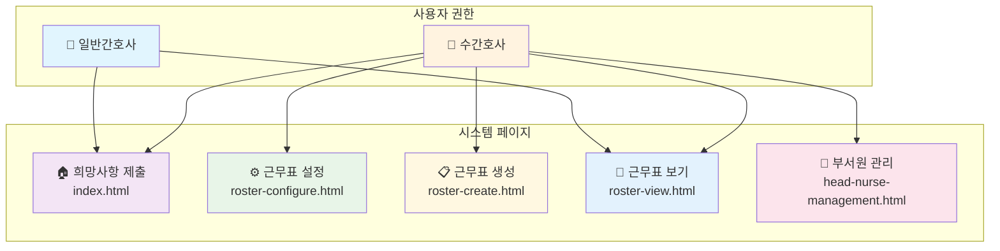
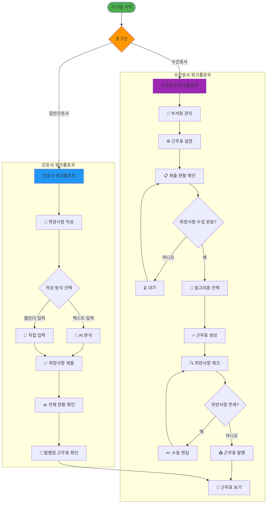
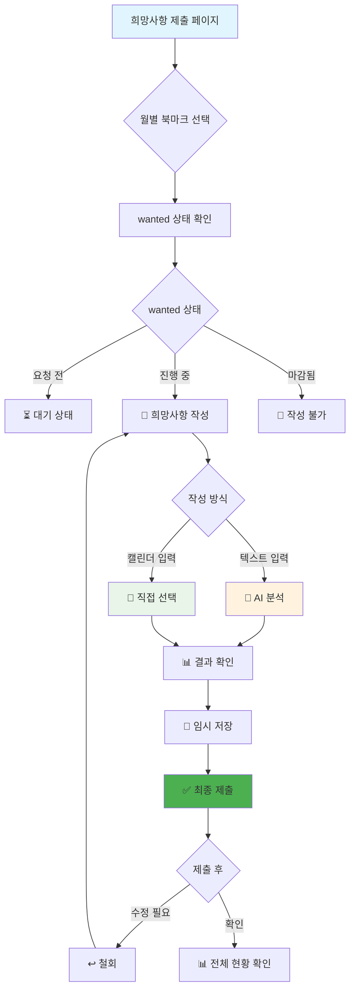
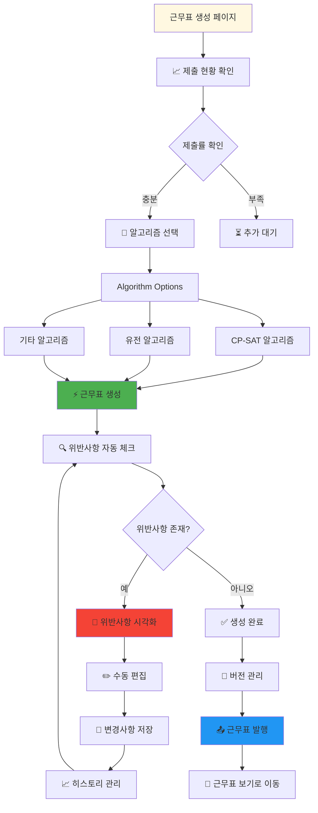
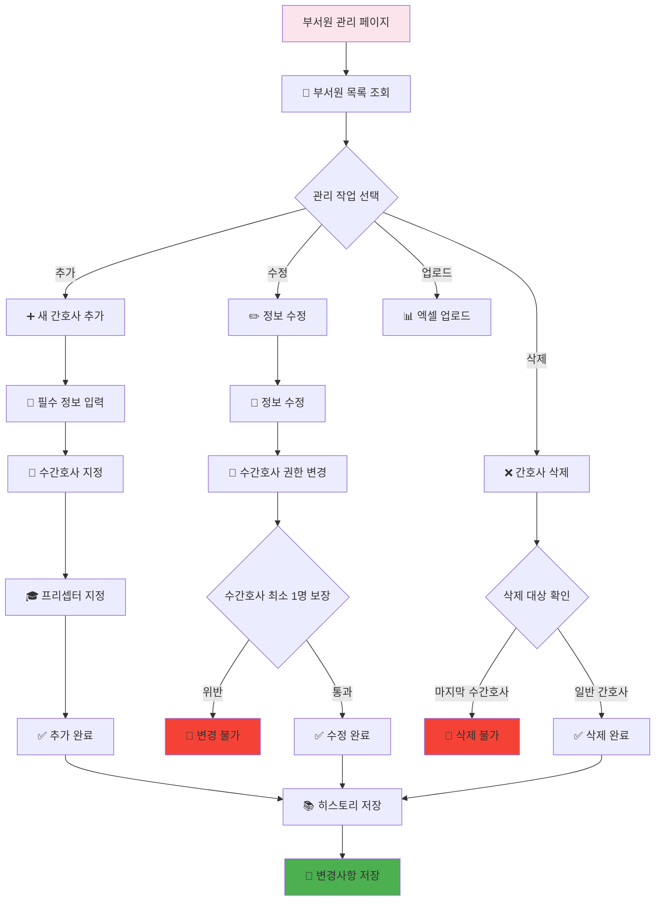
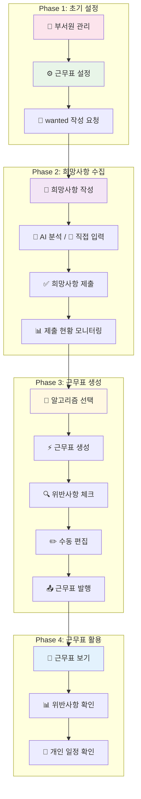
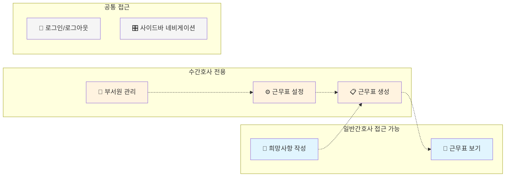

# 간호사 근무관리 시스템 플로우차트

## 전체 시스템 아키텍처

## 데이터 흐름도

## 페이지별 상세 기능 흐름

### 1. 희망사항 제출 페이지 (index.html)

### 2. 근무표 생성 페이지 (roster-create.html)

### 3. 부서원 관리 페이지 (head-nurse-management.html)

## 시스템 전체 통합 흐름

## 사용자 인터랙션 매트릭스

